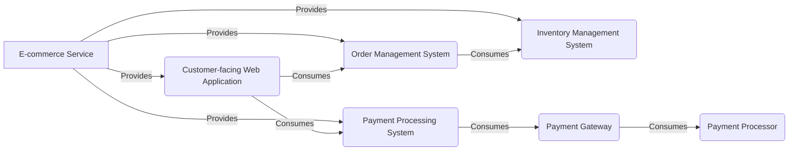
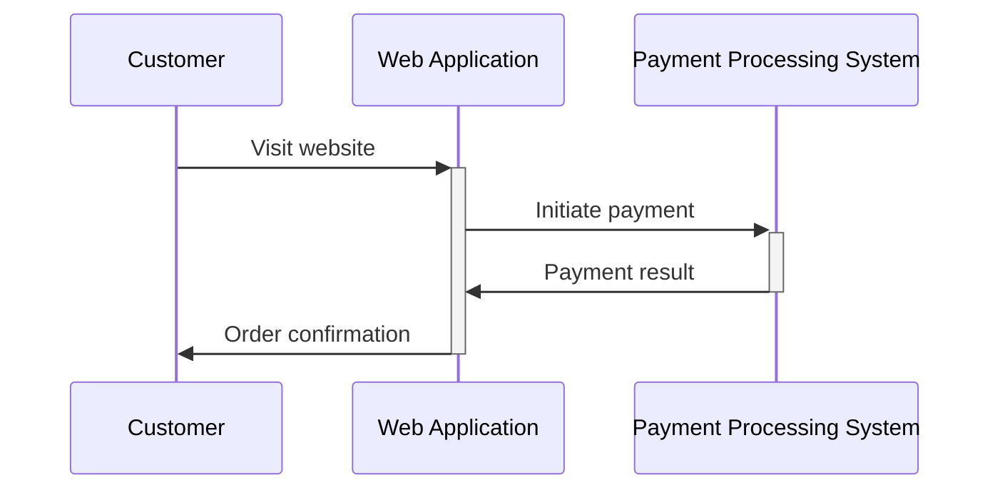
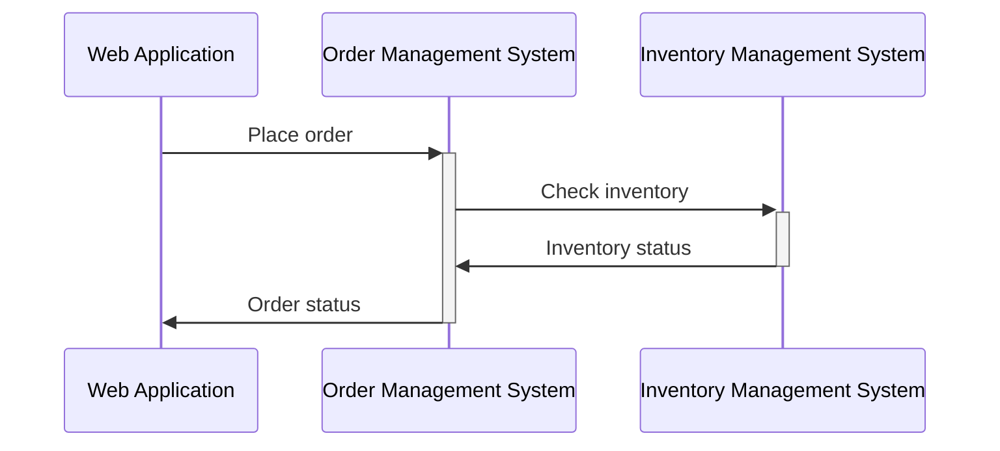
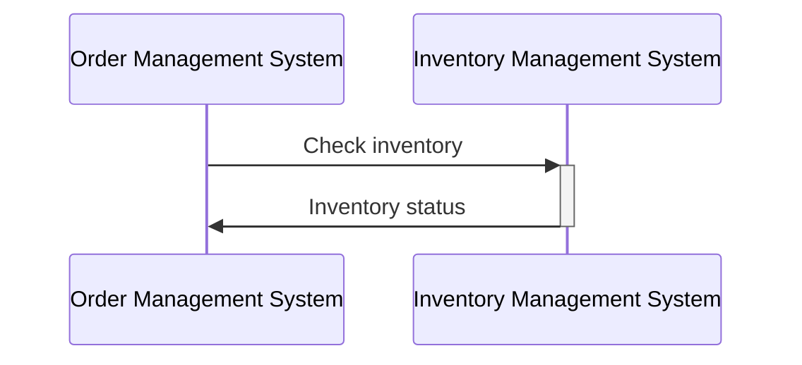
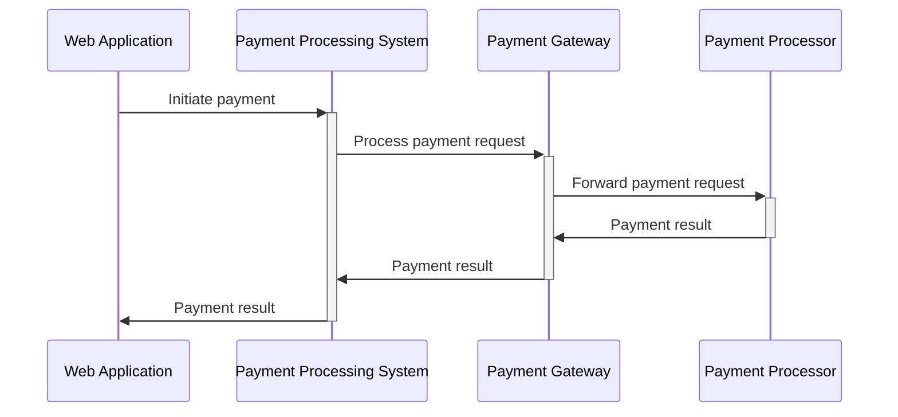
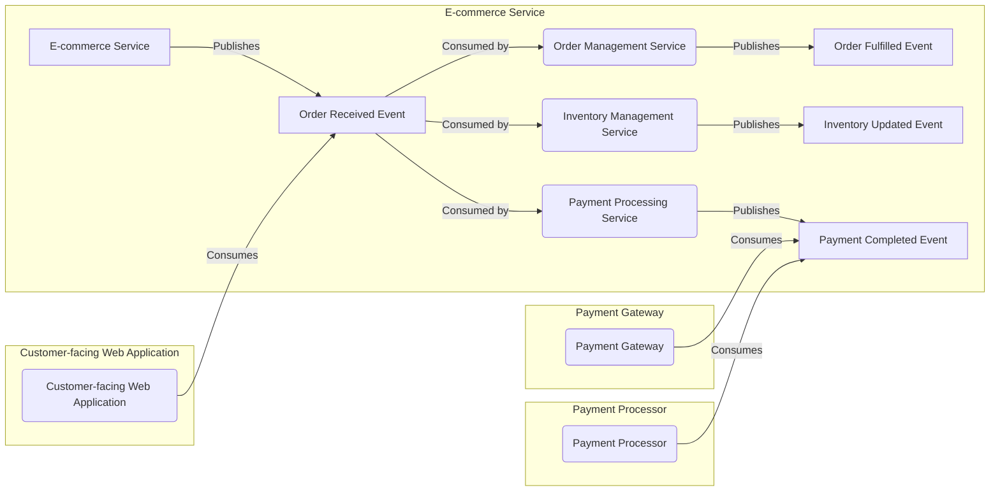
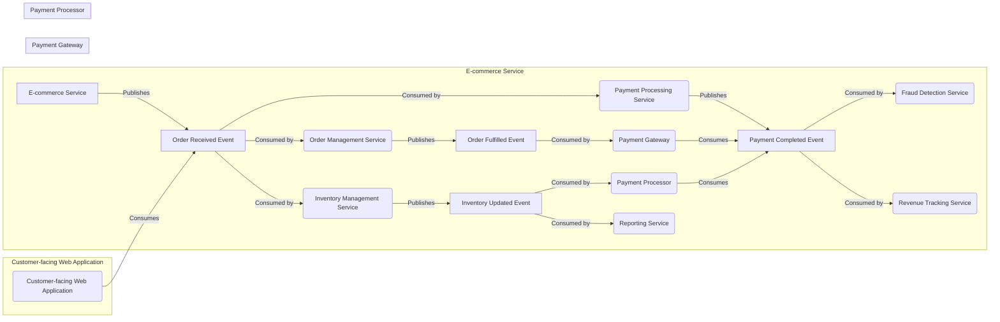
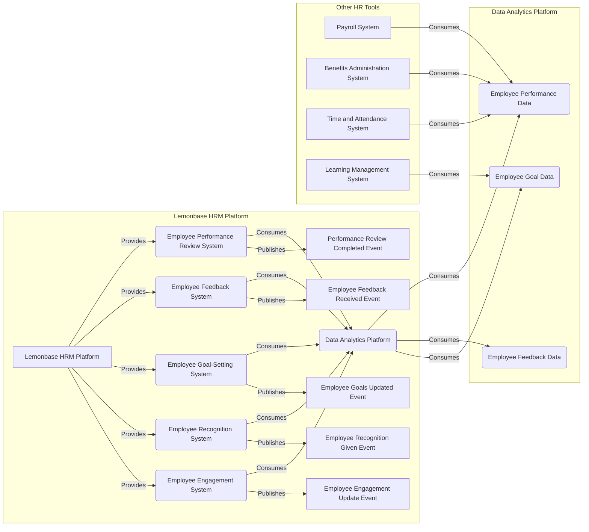

# 인간 시대의 끝이 도래했다

ChatGPT가 뜨겁다. 기술이야 나온지는 좀 됐지만,   
대중에게 챗봇 형태로 제공되니 그 충격과 확산의 속도는   
가히 인터넷의 등장 급이다.   

안전하지 않은 직업군이 없을 것은 불보듯 뻔한데,   
그냥 두 눈 시퍼렇게 뜨고 기계에게 대체될 것인지   
아니면 기계를 이용해 경제적 자유를 얻을지는   
각자의 재량인 시대다.   

가히, 인간 시대의 끝이 도래한 것이다!   


*러다이트 운동이 땡기는 요즘*

# Software Architect의 끝도 온 것일까?

문제는 창의적 영역 까지도 넘보는데,   
진짜 나중에 사람은 기계한테 관리받으면서   
음식만 받아먹는 `Wall-E` 영화 속의 사람들처럼   
말랑해지는거 아닌가 모르겠다.   

암튼, 잡설은 여기까지로 하고, **어떤 서비스의 간단한 Diagram**을   
서비스 설명을 통해 ChatGPT가 그릴 수 있는지를 한 번 살펴봤다.   
결과는 당연하게도 `훌륭했다`.   

결론부터 말하면, Software Architect의 끝은 아니지만   
정말 실력있는 설계자라면 오히려 너무나 행복할 자동화가,   
실력이 부족한 이들에게는 방 빼라는 메시지가 코 앞까지 왔다.   

아래 부터는 ChatGPT를 통해 어떻게 서비스의 기초 설계를   
할 수 있을지 Prompt + Mermaid code를 통해 설명한다.   

### 서비스 설명을 통해 간단한 ERD 그리기

<details>
    <summary>1. 일단 Mermaid는 아는지 물어보기</summary>

    > prompt
    ```
    Did you hear about Mermaid for markdown drawing language?
    ```
    > result
    ```
    Yes, I am aware of Mermaid, a popular markdown-based language for generating diagrams and flowcharts.
    ...
    ```

</details>

<details>
    <summary>2. E-Commerce Service에 대한 예시 구조 부탁하기</summary>

> prompt
```
Great! Then, can you write the structure of example of E-Commerce service into Mermaid?
```
> result

```
This diagram shows that the E-commerce Service provides several components, including a customer-facing web application, an order management system, an inventory management system, and a payment processing system. The customer-facing web application consumes the order management system and the payment processing system, while the order management system consumes the inventory management system. The payment processing system also consumes a payment gateway, which in turn consumes a payment processor.
```
</details>

<details>
    <summary>3. 출력된 결과에 대한 Detail 요구하기</summary>

> prompt
```
Perfect! In addition to this, can you write sequential diagrams for each of that?
```

> result
```
Certainly! Here are some examples of sequence diagrams for each component in the E-commerce Service:
```
#### Customer-facing Web Application Sequence Diagram

```
This sequence diagram shows the interaction between a customer (participant C) and the customer-facing web application (participant B) when the customer initiates a payment. The web application communicates with the payment processing system (participant E) to process the payment and returns the payment result to the web application, which then confirms the order with the customer.
```
#### Order Management System Sequence Diagram

```
This sequence diagram shows the interaction between the web application (participant B), the order management system (participant C), and the inventory management system (participant D) when a customer places an order. The web application communicates with the order management system to place the order, which then checks inventory availability with the inventory management system and returns the inventory status to the order management system. The order management system then returns the order status to the web application.
```
#### Inventory Management System Sequence Diagram

```
This sequence diagram shows the interaction between the order management system (participant C) and the inventory management system (participant D) when the order management system checks inventory availability. The order management system communicates with the inventory management system to check the inventory status, which is then returned to the order management system.
```
#### Payment Processing System Sequence Diagram

```
This sequence diagram shows the interaction between the web application (participant B), the payment processing system (participant E), the payment gateway (participant F), and the payment processor (participant G) when the customer initiates a payment. The web application communicates with the payment processing system to initiate the payment, which then communicates with the payment gateway to process the payment request. The payment gateway forwards the payment request to the payment processor, which then returns the payment result to the payment gateway, which returns it to the payment processing system, and finally to the web application.
```
</details>
<details>
    <summary>4. 출력된 결과를 Event-driven system 구조로 변경하기</summary>

> prompt
```
How about this? I've studied event-driven architecture. So can you re-write above structures to convert with event-driven system?
```
> result
```
Sure, here's an example of how the E-commerce Service structure could be re-written to be event-driven:
```

```
In this event-driven architecture, the E-commerce Service publishes an "Order Received Event" when a new order is received, which is then consumed by the Order Management Service, the Inventory Management Service, and the Payment Processing Service. Each of these services then publish their own events, such as the "Order Fulfilled Event," "Inventory Updated Event," and "Payment Completed Event," which can be consumed by other parts of the system.

The Customer-facing Web Application consumes the "Order Received Event," and the Payment Gateway and Payment Processor consume the "Payment Completed Event." This event-driven architecture allows the different components of the E-commerce Service to communicate with each other in a decoupled and scalable manner.
```
</details>
<details>
    <summary>5. Event-driven system 구조 detail 요청하기</summary>

> prompt
```
Hmm... There are dangling events such as "Order Fulfilled Event" and "Inventory Updated Event". Can you expand this structure in detail?
```
> result
```
Certainly, here's an expanded version of the event-driven architecture that includes the "Order Fulfilled Event" and the "Inventory Updated Event":
```

```
In this expanded architecture, the "Order Received Event" is still published by the E-commerce Service when a new order is received, and is consumed by the Order Management Service, the Inventory Management Service, and the Payment Processing Service. The Order Management Service then publishes the "Order Fulfilled Event," which is consumed by the Shipping Service to initiate shipping of the order.

The Inventory Management Service publishes the "Inventory Updated Event," which is consumed by the Alerts Service to trigger alerts if inventory levels are low, and by the Reporting Service to generate reports on inventory levels.

The Payment Processing Service still publishes the "Payment Completed Event," which is consumed by the Fraud Detection Service to detect fraudulent transactions, and by the Revenue Tracking Service to track revenue generated by the E-commerce Service.

The Customer-facing Web Application still consumes the "Order Received Event," and the Payment Gateway and Payment Processor still consume the "Payment Completed Event." This event-driven architecture allows the different components of the E-commerce Service to communicate with each other in a decoupled and scalable manner, while enabling additional services to be added to the system in a modular way.
```
</details>

종합해보면, 공부한 내용을 시각화하면서 보기도 좋고,   
Code로 바로 뽑아내서 Github에 올려 공유하기도 좋다.   
실무에서 서비스 설계를 이렇게 먼저 뽑아서   
초안을 확장시키기에도 좋아보인다.   

### 재직 중인 회사의 서비스 구조도 요청하기

2021년 정보까지 뿐이고, 국내 스타트업이다 보니   
정확한 결과를 출력하지는 않았다.   
그러나 추가 정보를 정교하게 주면 줄 수록   
실제 우리 서비스를 그대로   
ERD로 바꿀 수 있겠다는 생각이 든다.   



# 아직 끝은 아니고, 시작은 맞다

아무튼 뛰어난 Prompt Engineer가 되려면   
서비스에 대한 높은 이해와   
구현하고자 하는 시스템의 구성   
현재 회사에서 가용 가능한 리소스 정보 등   
알아야만 질문하고, `정교하게 질문`해야   
원하는 그림을 얻을 수 있겠다.   

즉, 아직 끝은 아니지만 `새로운 여명`이 펼쳐질 것은   
확실하다.   

당분간은 (최소 1~2년) 하던대로 공부를 하되,   
ChatGPT 등 AI 도움을 받아 지식은 견고히   
AI 사용은 능숙한 단계가 되어야겠다.   
